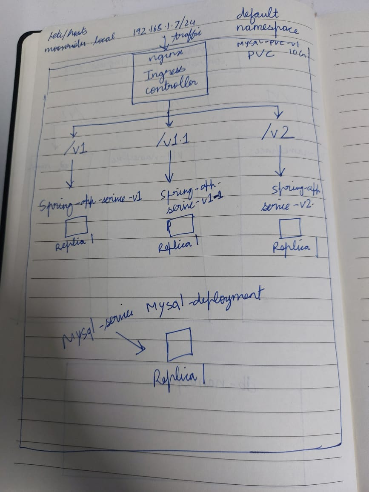

# Spring Boot CRUD Application - Kubernetes Multi-Version Architecture

This project demonstrates a microservices architecture using Spring Boot applications deployed on Kubernetes with multiple version support and shared database infrastructure.

## 🏗️ Architecture Overview

### Components
- **Spring Boot Applications**: Multiple versions (v1.0.0, v1.1.0, v2.0.0) of the same CRUD application
- **MySQL Database**: Shared database instance used by all application versions
- **Kubernetes Ingress**: Nginx ingress controller for routing traffic to different versions
- **Persistent Storage**: MySQL data persistence using PVC
- **Configuration Management**: Centralized ConfigMaps and Secrets

### Architecture Diagram



## 🌐 Access Points

### Application Endpoints
All applications share the same database and are accessible via different URL paths:

- **Version 1.0.0**: `http://moonrider.local/v1/*`
- **Version 1.1.0**: `http://moonrider.local/v1.1/*`
- **Version 2.0.0**: `http://moonrider.local/v2/*`

### API Endpoints
Each version exposes the same REST API:

- **Health Check**: `GET /actuator/health`


### Example Usage
```bash
# Health check for v1
curl -H "Host: moonrider.local" http://192.168.1.7/v1/actuator/health


## 🔧 Configuration

### Shared Resources
- **Database**: All versions connect to the same MySQL instance (`mysql-service:3306/javatechie`)

### Environment Variables
All Spring Boot applications use the same configuration:
- `SPRING_DATASOURCE_URL`: `jdbc:mysql://mysql-service:3306/javatechie`
- `SPRING_DATASOURCE_USERNAME`: `root`
- `SPRING_JPA_HIBERNATE_DDL_AUTO`: `update`
- `SPRING_PROFILES_ACTIVE`: `default`

## 📊 Monitoring and Health Checks

### Application Health
Each Spring Boot application includes:
- **Actuator Health Endpoint**: `/actuator/health`
- **Database Connectivity Check**: Automatic health checks
- **Readiness Probe**: Ensures application is ready to serve traffic

### MySQL Health
- **Liveness Probe**: MySQL ping every 10 seconds
- **Readiness Probe**: MySQL ping every 5 seconds
- **Resource Limits**: 1Gi memory, 500m CPU


## 🛠️ Troubleshooting

### Common Issues
1. **Ingress Not Working**: Check if nginx ingress controller is running
2. **Database Connection**: Verify MySQL pod is running and healthy
3. **Application Startup**: Check init container logs for MySQL readiness

## 🔒 Security Considerations

- **Secrets**: Database passwords stored as Kubernetes secrets
- **Network**: Services use ClusterIP (internal access only)
- **Ingress**: External access controlled via ingress rules
- **Resource Limits**: CPU and memory limits configured for all containers

## 📈 Scaling

### Horizontal Scaling
Each application version can be scaled independently:
```bash
kubectl scale deployment spring-app-v1-deployment --replicas=3
kubectl scale deployment spring-app-v1-1-deployment --replicas=2
kubectl scale deployment spring-app-v2-deployment --replicas=1
```

### Database Scaling
- MySQL is currently single-instance

## 🎯 Use Cases

This architecture is ideal for:
- **Feature Flags**: Testing new features in production
- **Canary Deployments**: Rolling out changes to a subset of users
- **Blue-Green Deployments**: Zero-downtime deployments
- **Multi-Tenant Applications**: Different versions for different customer segments

## 📝 Notes

- All resources are deployed in the `default` namespace
- The architecture supports easy addition of new application versions
- Database migrations should be handled carefully when schema changes are needed
- Consider implementing proper monitoring and logging for production use